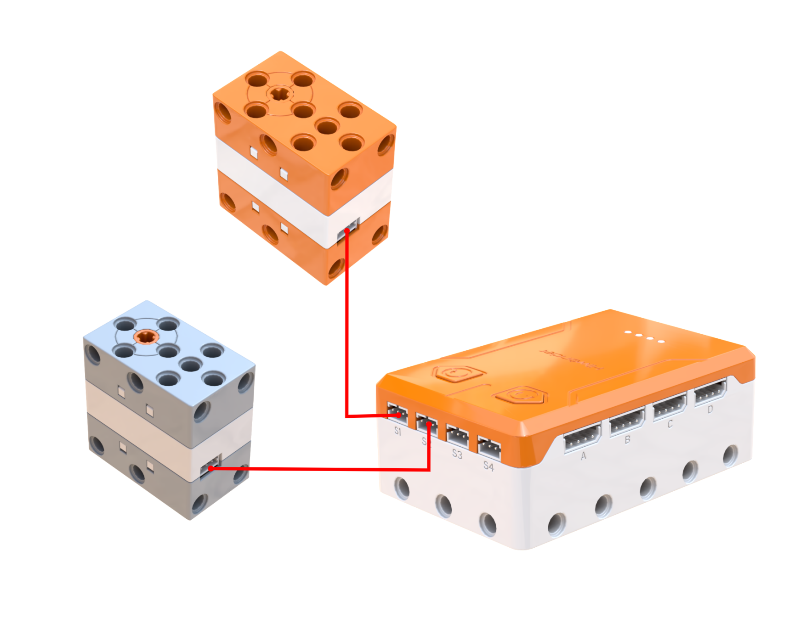
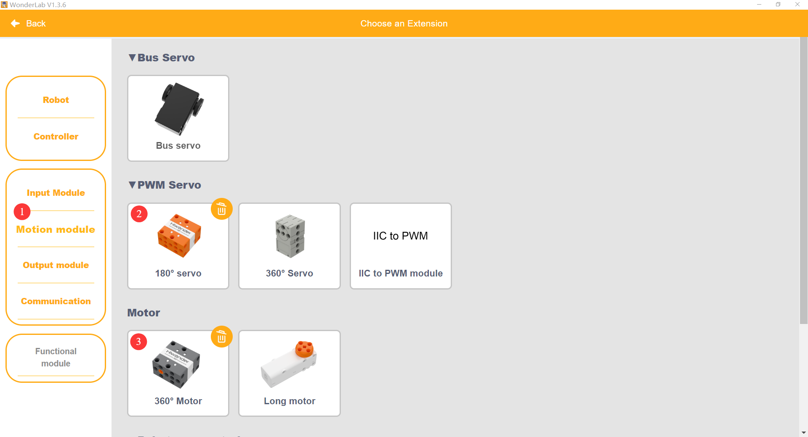
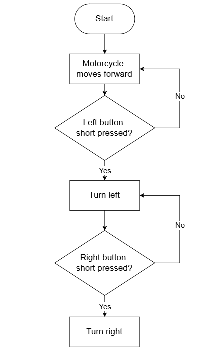
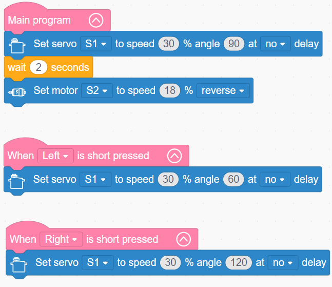
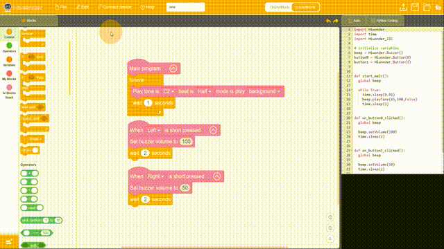

# 3.12 Motorized Motorcycle

## 3.12.1 Lesson Introduction

Taking inspiration from two-wheeled motorcycles, this lesson guides the assembly of an electric vehicle combining belt drive transmission with servo-driven steering. The lesson details the mechanics and characteristics of belt drive systems, explains dual-actuator cooperative control logic, and distributes propulsion to the motor while assigning directional steering to the servo. This lesson introduces belt transmission fundamentals, masters multi-actuator separation in programming, and establishes a foundation for advanced vehicular robotics.

## 3.12.2 Learning Objectives

1. **Knowledge Objectives**: Understand belt transmission structures, friction-based drive principles, and operational characteristics such as smooth power delivery and overload buffering. Master the division of labor between motor propulsion and servo steering. Consolidate independent programming for motors and servos.

2. **Skill Objectives**: Complete vehicle assembly and belt tension installation independently. Master servo centering and front-wheel alignment. Program dual-actuator control routines for continuous driving and steering adjustments. Acquire practical techniques for tuning belt tension.

3. **Thinking Objectives**: Establish system-level thinking regarding multi-module task separation. Understand mechanical criteria for selecting transmission mechanisms. Cultivate engineering awareness of decoupling propulsion from directional steering. Strengthen parallel programming capabilities across multiple actuators.

4. **Application Objectives**: Relate belt transmission concepts to household washing machines, fitness treadmills, and automotive engine belts. Recognize the engineering value of belt drives. Stimulate interest in vehicular engineering and mechanical powertrain design.

## 3.12.3 Preparation

### (1) Hardware Preparation

- AiBlock controller

- 360° block motor

- 180° block servo

- Building block parts pack

- Type-C data cable

- Assembly manual

- Computer

### (2) Software Preparation

- WonderLab Graphical Programming Platform

## 3.12.4 Hands-On Project

### (1) Project Analysis

The core project of this lesson is the belt-driven Motorized Motorcycle, which integrates independent propulsion and steering systems. Propulsion relies on a belt transmission mechanism that delivers quiet, smooth operation while protecting the motor from stall damage via friction slipping under overload conditions. Directional steering relies on a servo that sets the steering angle to 90° for straight driving, 60° for left turns, and 120° for right turns. The software architecture combines a main execution routine for motor driving with parallel button event handlers for real-time steering changes. This project demonstrates the decoupled powertrain and steering model of vehicle engineering, reinforcing the cooperative integration of dual actuators.

### (2) Assembly Guide

<Pdf src="../../_static/shared/pdf/chapter_3/12.1.pdf" />

### (3) Hardware Wiring

- Connect the 180° block servo to port **S1** of the controller using a 3-pin servo cable.

- Connect the 360° block motor to port **S2** of the controller using a 3-pin servo cable.

### (4) Adding Extensions

- Select **180° servo** and **360° Motor** under the **Motion module** category.

### (5) Core Blocks

| Block | Category | Description |
| :---: | :---: | :--- |
|  |  | Triggers corresponding blocks when the button is short-pressed |
|  |  | Sets the operating speed and rotation direction of the designated motor |
|  |  | Controls the designated servo to rotate to a target angle at a specified speed |

### (6) Program Description and Upload

- Program Schematic

- Complete Program

  1. When executing the main program, servo S1 rotates to 90° at 30% speed without delay. After a delay of 2 s, motor S2 engages in reverse rotation at 18% speed.

  2. Button event logic is configured simultaneously:
     - Short-pressing the left button directs servo S1 to rotate to 60° at 30% speed without delay.
     
     - Short-pressing the right button directs servo S1 to rotate to 120° at 30% speed without delay.

- Program Upload

  Following the animation, click **Connect device**, select the serial port, then click the upload button to upload the program to the controller and test the execution results.

> [!NOTE]
>
> **The source files are available for download under [Program Files](https://drive.google.com/drive/folders/1xyD_-3msc3KcaGQHLqkcPOZNSNXFIirT?usp=sharing).**

## 3.12.5 Expansion and Challenge

**Project 1: Motorcycle Rider Add-On**

Mount a rider figure block assembly onto the existing vehicle chassis without altering original motor or servo wiring, hardware, or code. Retain the fundamental forward driving and directional steering operations while adding the anthropomorphic rider figure. Practice modular structural remodeling while keeping core mechanical transmissions unobstructed to build an authentic rider-operated motorcycle model.

**Assembly Guide:**

<Pdf src="../../_static/shared/pdf/chapter_3/12.2.pdf" />

**Project 2: Obstacle-Avoidance Smart Motorcycle**

Mount an ultrasonic sensor to enable automatic collision-avoidance turning when detecting obstacles. Continuously monitor forward distance: when obstacles approach within a set threshold, steer automatically to bypass before returning to a straight path. Practice sensor-driven steering control logic, upgrading manual button steering into automated responsive navigation to simulate foundational self-driving obstacle avoidance.

**Project 3: Three-Speed Motorcycle**

Configure three speed presets: low speed at 10% for cruising, medium speed at 20% for standard driving, and high speed at 35% for sprinting. Use button presses to cycle sequentially through speeds. Coordinate speed shifts with servo steering to produce a comprehensive remote-controlled motorcycle. Practice variable state recording and multi-speed state management to construct a feature-rich mobile robot.

## 3.12.6 Q&A

**Question 1: Why does the Motorized Motorcycle require two ports, and what specific functions do S1 and S2 handle?**

Answer: The motorcycle integrates two distinct mechanical functions: propulsion and steering, requiring two dedicated actuators. **Port S1 connects to the servo**, which governs directional steering like handlebars or a steering wheel, rotating to designated angles to guide the front wheel left, right, or straight ahead. **Port S2 connects to the motor**, which supplies motive power like an engine, spinning the rear wheel to drive the motorcycle forward or halting to stop. The two actuators maintain a clear division of labor: one manages direction while the other regulates driving speed, operating without mutual interference yet in close coordination. This represents the classic automotive engineering architecture of decoupling powertrain propulsion from directional steering, an approach utilized across automobiles, motorcycles, and mobile robotics.

**Question 2: Why is belt tension critical in a belt drive system, and what happens if the belt is too loose or too tight?**

Answer: Belt transmission relies entirely on frictional contact, meaning belt tension directly determines the magnitude of transmitted friction force. **If the belt is too loose**, insufficient normal contact pressure between the belt and pulley generates inadequate friction, causing the belt to slip and spin freely around the driving pulley without transferring torque. Consequently, the wheels fail to spin or turn sluggishly, similar to a dislodged bicycle chain slipping when pedaling. **If the belt is too tight**, excessive tensile tension accelerates mechanical fatigue, drastically shortening belt lifespan and potentially causing snap failures. Furthermore, the motor expends excessive energy pulling against high tension, consuming surplus electrical power and increasing radial load on motor bearings. Therefore, tension must remain properly balanced: pressing gently on the belt with a finger should yield slight deflection without slipping during operation. Industrial machinery commonly integrates dedicated tensioner idler pulleys to maintain optimal belt tension automatically.

## 3.12.7 Technical Support and Product Discussion

To share creative ideas and projects after exploring this kit, visit the [Hiwonder Community](http://forum.hiwonder.com): forum.hiwonder.com

