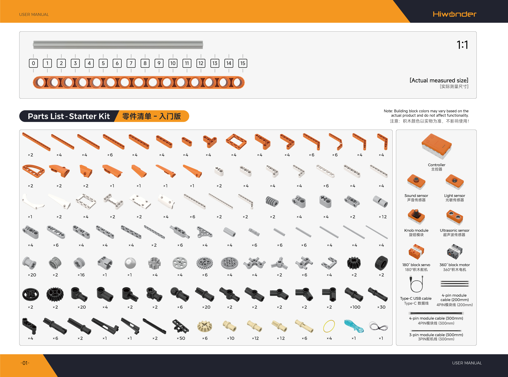

# 1. Starter Kit Introduction

## 1.1 Kit Overview

Designed specifically for elementary students aged 7 to 12, the AiBlock TechPower Starter Kit features an integrated intelligent controller at its core. It includes multiple sensor modules, motorized actuators, and a comprehensive set of mechanical building blocks. The kit comes with a progressive, tiered curriculum alongside the WonderLab graphical programming platform, seamlessly integrating mechanical assembly with intelligent sensory interaction. The diverse block components support building various models including robots and mechanical transmission mechanisms. Learners advance progressively from foundational power transmission to intelligent programming. Through hands-on practice, this kit cultivates spatial reasoning, practical assembly skills, and algorithmic control thinking, providing a systematic foundation in scientific innovation.

## 1.2 Product Features

1. **Tiered Dual Learning Modes**: The kit supports two distinct learning modes, including non-controller mechanical assembly and controller-based intelligent programming. Beginners start with hands-on building and progressively advance to coding, which significantly lowers the barrier to entry for STEAM education.

2. **Multi-Functional Integrated Controller**: Equipped with an integrated smart controller accompanied by 4 sensor types, block servos, and DC motors. The controller features stable power output and clearly labeled port zones, enabling precise and straightforward hardware control.

3. **Comprehensive Mechanical Block Accessories**: Packed with an ample supply of transmission and structural building blocks, covering mechanical components such as gears, levers, and pulleys. Diverse parts support open-ended creative builds while exercising hands-on practical skills and logical thinking.

4. **Systematic Thematic Curriculum Projects**: Includes 16 engaging projects centered on AI and mechanical power themes aligned with elementary science curricula. Real-world-inspired models stimulate creativity and scientific inquiry.

5. **Dedicated Graphical Programming Software**: The drag-and-drop visual programming platform operates simply without complex code. It matches curriculum project programs synchronously, accommodating both classroom instruction and home practice.

## 1.3 Product Specifications

| Item | Specification |
| :--- | :--- |
| Brand | Hiwonder |
| Model | AiBlock TechPower Starter Kit |
| Programming software | WonderLab Graphical Programming / Hiwonder Python Editor |
| Recommended age | 6+ |
| Electronic modules | Ultrasonic sensor, light sensor, sound sensor, knob module, 180° block servo, 360° block motor |
| Communication port | USB port |
| Block count | 600+ |
| Material | ABS |
| Weight including packaging | 1.8 kg |
| Package dimensions | 365 × 270 × 120 mm |

## 1.4 Packing List

