---
prev:
  text: 3. Creative Builds
  link: /docs/3.%20Creative%20Builds.html
---

# 4. Software and Hardware Guide

## 4.1 AiBlock Controller

### 4.1.1 Overview

This section introduces the AiBlock controller. It is an intelligent controller driven by an MM32 coprocessor with an ESP32 core, supporting both graphical programming and Python programming. Enclosed in a durable PC plastic casing, it integrates 4-channel PWM servo ports, 4-channel multi-functional motor ports, programmable buttons, and an onboard buzzer. It provides multiple reserved sensor ports for high expandability. Standardized 4-pin anti-reverse connectors ensure seamless and safe compatibility with the entire suite of AiBlock sensors.

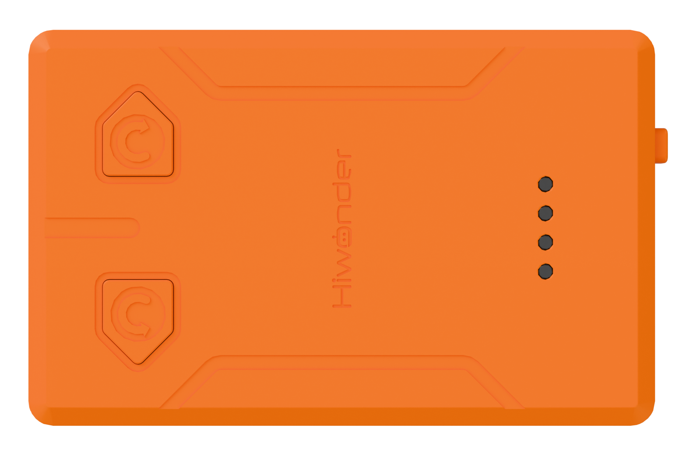

### 4.1.2 Functional Layout

> [!NOTE]
>
> * **Ports M1 through M4 serve as long motor ports.**
>
> * **Ports A through D serve as sensor ports.**
>
> * **Ports S1 through S4 serve as block servo and block motor ports.**

### 4.1.3 Port Descriptions

| Port | Description |
| :--: | :--: |
| Type-C port | Program upload and power supply |
| Power switch | Toggle between **OFF** and **ON** |
| Power indicator | Display power supply status |
| Ports A through D, also known as I2C ports | Sensor ports |
| Ports M1 through M4 | Long motor ports |
| Ports S1 through S4 | Block servo and block motor ports |
| Two programmable buttons | Customizable trigger functions |
| Buzzer | Play musical tones and alert sounds |
| Block mounting holes | Compatible with standard building blocks for assembly |

### 4.1.4 Technical Specifications

| Item | Specification |
| :--: | :--: |
| Product name | AiBlock controller |
| Dimensions | 88 × 56 × 31.5 mm |
| Charging voltage | 5 V |
| Charging current | 1500 mA |
| Charging time | 3.5 h |
| Battery capacity | 3000 mAh / 11.1 Wh |
| Maximum operating voltage | 4.2 V |
| Rated operating voltage | 3.7 V |

## 4.2 WonderLab Programming Software

### 4.2.1 Software Overview

WonderLab serves as the dedicated Scratch-based programming software tool for Hiwonder products. The software supports automatic conversion between graphical command blocks and Python code. Code is created simply by dragging and dropping command blocks, making it ideal for beginners learning programming.

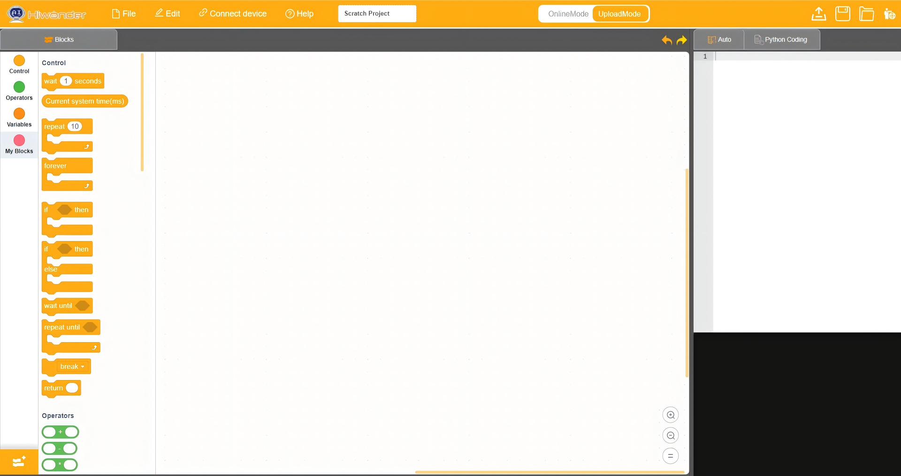

### 4.2.2 Downloading Graphical Programming Software

[WonderLab Programming Platform Download for Windows](https://k12.hiwonder.com.cn/download/pcSoftware?get_pc=1&os=windows)

### 4.2.3 Installing WonderLab Programming Software

1. Open the **WonderLab setup.exe** software installation package.

2. Select the preferred language, then click **OK** to confirm.

3. Choose the installation destination folder, then click **Next** to continue.

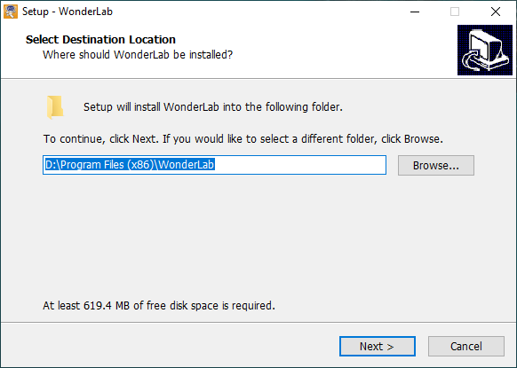

4. Click **Next** to proceed.

5. Click **Install** to start the installation process.

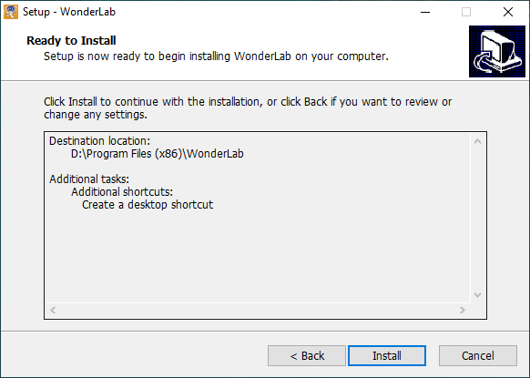

6. Once the installation completes successfully, click **Finish** to exit the setup wizard.

### 4.2.4 Interface Overview

The following image illustrates the functional areas of the WonderLab software: 1 represents the Menu Bar, 2 represents the Block Palette, 3 represents the Script Area, and 4 represents the Code Display and Upload Area.

Corresponding functions are detailed in the table below:

| Icon | Function |
| :---: | :--- |
|  | Create, save, and open program files |
|  | Used for online mode, for informational purposes only |
|  | Determine whether to connect the device to the software and select the connection port |
|  | Access help documentation, check for updates, and install device drivers |
|  | Display the program file name, showing Untitled Project when programming has not begun or the file has not been saved |
|  | Interface toggle button to switch between Online Mode and Upload Mode |
|  | Set the interface display language to English |
|  | Undo or redo operations while editing programs |
|  | Mode toggle button, where **Auto** transforms block programs into Python code, and **Python Coding** allows direct editing in Python |
|  | Save the program as Python code |
|  | Open saved Python files |
|  | Interact with the device to upload programs to the controller |
|  | Add extension packages for devices and modules |
|  | Zoom in, zoom out, or restore the default zoom level of the code editing area from top to bottom |

### 4.2.5 Core Programming Blocks

| Command Block | Category | Description |
| :---: | :---: | :--- |
|  |  | Pause for 1 s before continuing subsequent code, commonly used for action intervals and timing buffers. |
|  |  | Read the total elapsed milliseconds since device power-on, applicable for timing and interval calculations. |
|  |  | Repeat nested code for a designated number of times, then exit the loop. |
|  |  | Run nested instructions in an infinite loop, continuously repeating internal logic. |
|  |  | Perform basic conditional judgment, executing internal code when the condition is true and skipping it when false. |
| 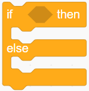 |  | Perform dual-branch conditional judgment, executing the if branch when the condition is true and the else branch when false. |
|  |  | Pause the program for a custom duration based on numerical input. |
|  |  | Run nested code repeatedly until the specified condition becomes true, then exit the loop. |
|  |  | Terminate the current loop early and proceed immediately to subsequent instructions. |
|  |  | Return specified data from within a custom function to the calling location. |
| 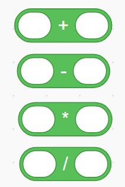 |  | Perform basic arithmetic operations on two input numbers and output the result. |
|  |  | Perform modulo operations to calculate the remainder after division. |
|  |  | Generate a random integer within a specified numerical range. |
|  |  | Compare two numbers and return a boolean true or false result. |
|  |  | Perform logical AND operations, returning true only when all conditions are met. |
|  |  | Perform logical OR operations, returning true when at least one condition is met. |
|  |  | Perform logical NOT operations, inverting the original boolean value. |
|  |  | Boolean constants providing true and false logic values for conditional judgment. |
|  |  | Input custom text to generate string data for concatenation, display, and comparison. |
|  |  | Concatenate two strings into a single complete text string. |
|  |  | Extract a single character from a string at a specified index. |
|  |  | Get the total character count contained in a string. |
|  |  | Check whether a string contains specified text or characters, returning a boolean value. |
|  |  | Convert numeric text into an integer value. |
|  |  | Convert a number into a text string. |
|  |  | Decode UTF-8 byte data back into standard text characters. |
|  |  | Encode standard text into UTF-8 byte data. |
|  |  | Convert a character into its corresponding Unicode numerical value. |
|  |  | Extract a substring of specified length starting from a given index. |
|  |  | Find the first occurrence index of target text within a string. |
|  |  | Split a string into multiple segments using a designated delimiter to generate a list. |
|  |  | Round a decimal number to the nearest integer. |
| 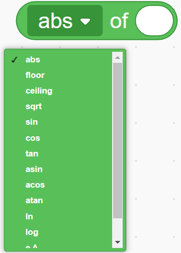 |  | Common mathematical functions for rounding, trigonometric calculations, square roots, and logarithms. |
|  |  | Read data at a specified index from a list or tuple. |
|  |  | Check whether specified content exists within a list or tuple, returning a boolean result. |
|  |  | Create a key-value pair to construct dictionary data. |
|  |  | Retrieve stored data from a dictionary based on a key name. |
|  |  | Retrieve data associated with a key from a dictionary, returning a default value if the key does not exist. |
|  |  | Boolean constants providing true and false logic values. |
|  |  | Null constant representing the absence of valid data. |
|  |  | Linearly map an input value from an original interval to a target interval for range conversion. |
|  |  | Create a custom-named variable to store single data items like numbers or text. |
|  |  | Assign a value to a specified variable, overwriting previous content. |
|  |  | Increment a numeric variable by adding a specified value to its current number. |
|  |  | Display the current data stored in a variable on the visual stage. |
|  |  | Hide the variable display on the visual stage. |
|  |  | Read the data stored in a variable for operations, conditions, and outputs. |
|  |  | Create an empty list with a custom name to store multiple data items. |
|  |  | Generate an empty list container to hold various data types for management. |
|  |  | Append a new element to the end of a list. |
|  |  | Remove an element from a list at a specified index. |
|  |  | Clear all elements from the target list, resetting it to an empty list. |
|  |  | Insert custom content before a specified index in a list. |
|  |  | Modify the element at a specified list position, overwriting the original content. |
|  |  | Read the element stored at a specified index in a list. |
|  |  | Find the first occurrence index of target content within a list. |
|  |  | Get the total count of elements currently stored in a list. |
|  |  | Check whether a specified element exists in a list, returning a boolean result. |
|  |  | Show the complete contents of a list on the visual stage. |
|  |  | Hide the list display on the visual stage. |
|  |  | Create a custom function block defining name, parameters, and internal execution logic. |
|  |  | Create a parameterless custom function to encapsulate reusable program logic. |
|  |  | Call a defined parameterless function to execute all encapsulated instructions. |
|  |  | Create a parameterized custom function that accepts number or text arguments for internal processing. |
|  |  | Parameter container within a custom function that receives incoming number or text data. |
|  |  | Supply arguments of number or text type when calling a parameterized function. |

### 4.2.6 AiBlock Controller Extension Blocks

| Command Block | Category | Description |
| :---: | :---: | :--- |
|  |  | Acts as the main program loop container, continuously executing nested code after power-on initialization. |
|  |  | Executes only once upon device startup, used for hardware initialization and parameter configuration. |
|  |  | Drives the buzzer to play notes with specified pitch and beat in the background without blocking subsequent program execution. |
|  |  | Drives the buzzer with a numerical pitch and custom duration in the background without blocking execution. |
|  |  | Adjusts buzzer volume within a range of 0 to 100, where higher values produce louder volume. |
|  |  | Stops buzzer sound immediately, terminating current audio playback. |
| 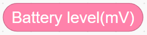 |  | Reads current controller battery voltage in millivolts for power monitoring and evaluation. |
|  |  | Prints custom text strings to the computer through the serial port for debugging and monitoring. |
| 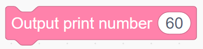 |  | Prints specified numeric values to the computer through the serial port for data debugging. |
|  |  | Functions as an event trigger block that executes nested code when a short press on the specified button is detected. |
| 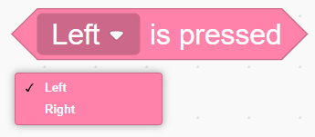 |  | Detects the real-time electrical level of the specified button and returns a boolean value to determine whether the button is pressed. |
| 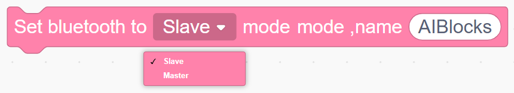 |  | Configures Bluetooth operating mode as master or slave, sets a custom device name, and initializes Bluetooth functionality. |
|  |  | Checks Bluetooth link connection status and returns a boolean value indicating whether the connection is established. |
|  |  | Reads the local Bluetooth hardware MAC address string. |
|  |  | Checks whether data in the Bluetooth buffer contains a designated identifier character. |
|  |  | Reads complete raw data received by the Bluetooth module. |
|  |  | Parses the Bluetooth data packet according to the communication protocol and extracts the command field. |
|  |  | Parses the Bluetooth data packet according to the communication protocol and extracts the parameter at the specified index. |
|  |  | Transmits custom text or command data outward via Bluetooth. |

## 4.3 Electronic Module Introduction

### 4.3.1 360° Block Motor

#### (1) Overview

This module is a PWM servo. Controlling the port number, rotation speed, and rotation direction drives the servo to rotate clockwise or counterclockwise at a designated speed.

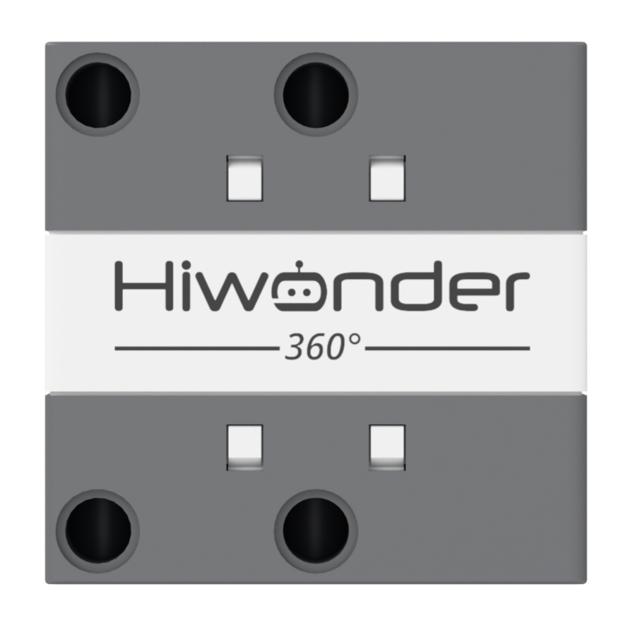

#### (2) Technical Specifications

| Item | Specification |
| :--: | :--: |
| Operating voltage | 5 V |
| Stall torque | 1.5 kg·cm |
| Angle range | 0° to 360° |
| Dimensions | 54.0 × 54.0 × 40.0 mm |

#### (3) Wiring Diagram

Connect the 360° block motor to any port among **S1** through **S4** on the controller using a 3-pin servo wire, as shown below:

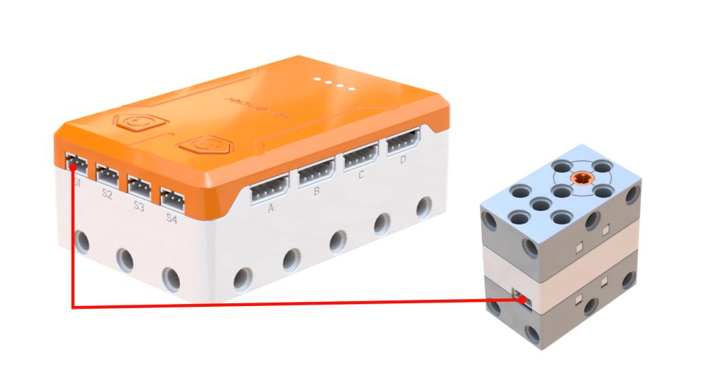

#### (4) Project Practice

Case 1: Motor Forward and Reverse Rotation with Delayed Start and Stop

Add Extension: Select **360° Motor** under the **Motion module** category.

Program Logic: Controls the motor to rotate forward at 30% speed for 3 s, and then reverse at 60% speed for 3 s.

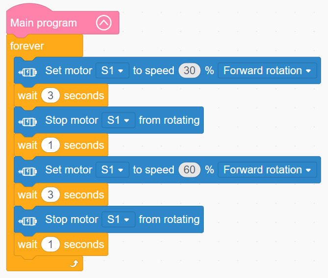

Program Upload Instructions:

Click **Connect device**, select the serial port, then click the upload button to upload the program to the controller and test the execution results.

> [!NOTE]
>
> **The source files are available for download under [Program Files](https://drive.google.com/drive/folders/1a23HgK6TJsjvy8iI9FvrCsSFKtjoYULN?usp=sharing).**

### 4.3.2 180° Block Servo

#### (1) Overview

This module is a PWM servo. Setting the port number, rotation speed, and target angle drives the servo to a designated position, with an angle range from 0° to 180°.

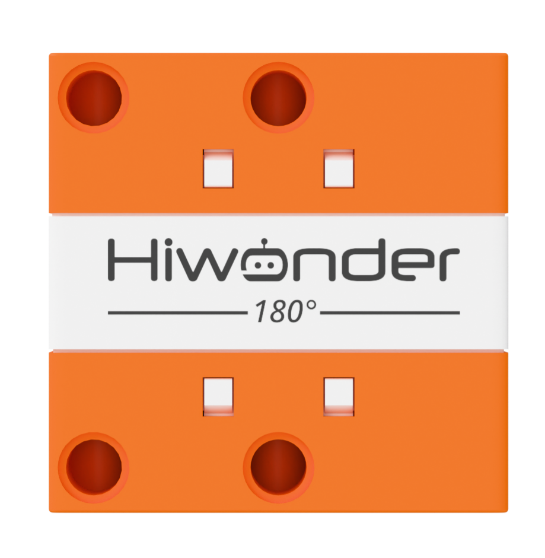

#### (2) Technical Specifications

| Item | Specification |
| :--: | :--: |
| Operating voltage | 5 V |
| Stall torque | 1.5 kg·cm |
| Angle range | 0° to 180° |
| Dimensions | 54.0 × 54.0 × 40.0 mm |

#### (3) Wiring Diagram

Connect the 180° block servo to any port among **S1** through **S4** on the controller using a 3-pin servo wire, as shown below:

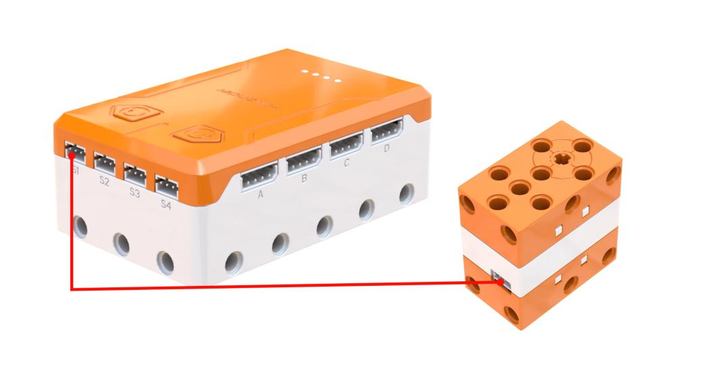

#### (4) Project Practice

Case 1: Dual-Speed Servo Reciprocating Sweep

Add Extension: Select **180° servo** under the **Motion module** category.

Program Logic: Controls the servo to rotate at 30% speed to 180° and then return to 0°, and then rotate at 60% speed to 180° and return to 0°.

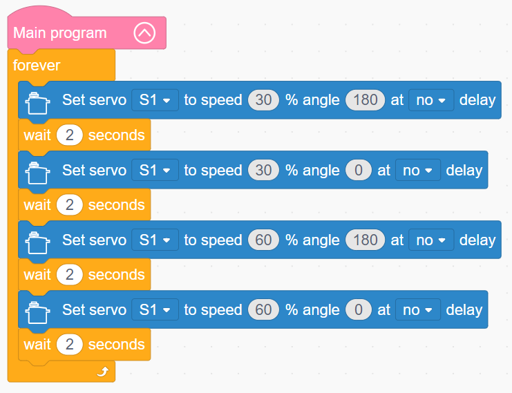

Program Upload Instructions:

Click **Connect device**, select the serial port, then click the upload button to upload the program to the controller and test the execution results.

> [!NOTE]
>
> **The source files are available for download under [Program Files](https://drive.google.com/drive/folders/1a23HgK6TJsjvy8iI9FvrCsSFKtjoYULN?usp=sharing).**

### 4.3.3 Ultrasonic Sensor

#### (1) Overview

This module is a glowing ultrasonic ranging sensor featuring an industrial-grade ultrasonic ranging chip that integrates transmitting circuits, receiving circuits, and digital processing circuits. The module adopts an I2C communication interface, enabling distance measurements to be read over the I2C bus.

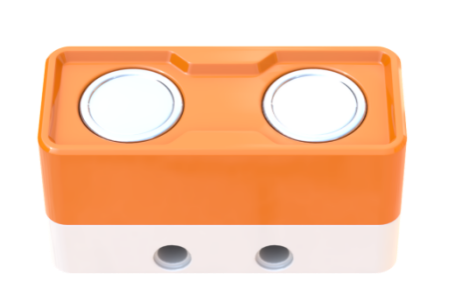

#### (2) Technical Specifications

| Item | Specification |
| :--: | :--: |
| Connector model | 5264-4AW |
| Communication method | I2C |
| Operating voltage | 5 V |
| Dimensions | 55.4 × 23.4 × 27.2 mm |

#### (3) Wiring Diagram

Connect the ultrasonic sensor to any port among **A** through **D** on the controller using a 4-pin module wire, as shown below:

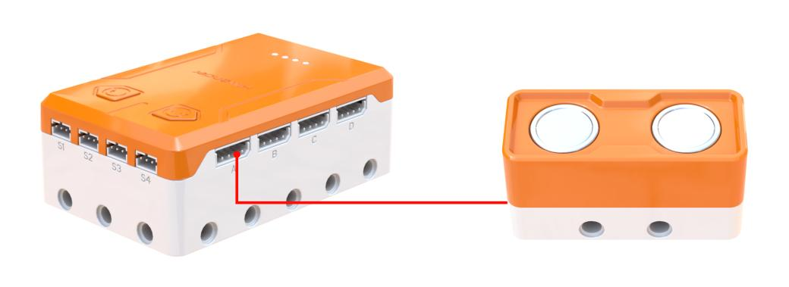

#### (4) Project Practice

Add Extension: Select **Ultrasonic sensor** under the **Input Module** category.

Case 1: Real-Time Serial Distance Display

Program Logic: Displays the obstacle distance detected by the ultrasonic sensor through the AiBlock serial port.

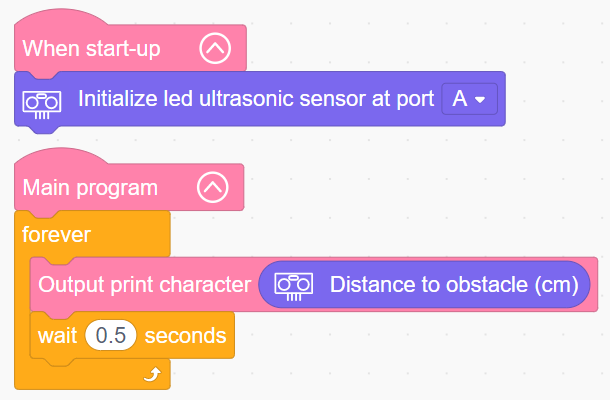

Case 2: Proximity Obstacle Buzzer Alarm

Program Logic: Sound a buzzer alarm based on ultrasonic distance detection. When the obstacle distance exceeds 20 cm, the buzzer remains silent. When the obstacle distance is under 20 cm, the buzzer sounds an alarm.

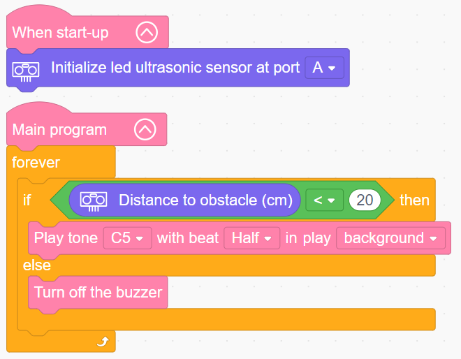

Case 3: Ultrasonic RGB Lighting Effects

Program Logic: Controls color switching and breathing light patterns for the ultrasonic RGB lights.

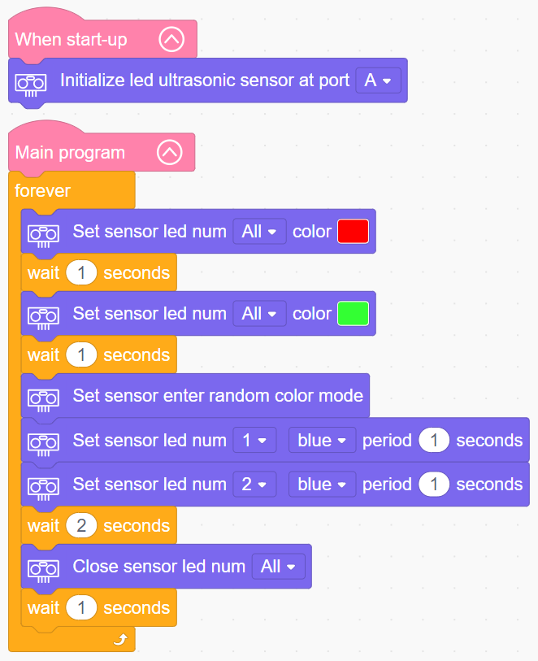

Program Upload Instructions:

Click **Connect device**, select the serial port, then click the upload button to upload the program to the controller and test the execution results.

> [!NOTE]
>
> **The source files are available for download under [Program Files](https://drive.google.com/drive/folders/1a23HgK6TJsjvy8iI9FvrCsSFKtjoYULN?usp=sharing).**

### 4.3.4 Sound Sensor

#### (1) Overview

This sensor detects ambient sound intensity. It is widely used in sound-controlled robots, sound-activated switches, and acoustic alarm systems.

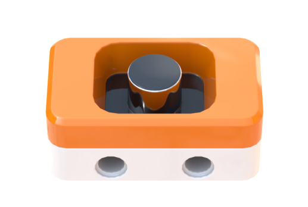

#### (2) Technical Specifications

| Item | Specification |
| :--: | :--: |
| Connector model | 5264-4AW |
| Communication method | I2C |
| Operating voltage | 5 V |
| Dimensions | 39.5 × 23.4 × 18.7 mm |

#### (3) Wiring Diagram

Connect the sound sensor to any port among **A** through **D** on the controller using a 4-pin module wire, as shown below:

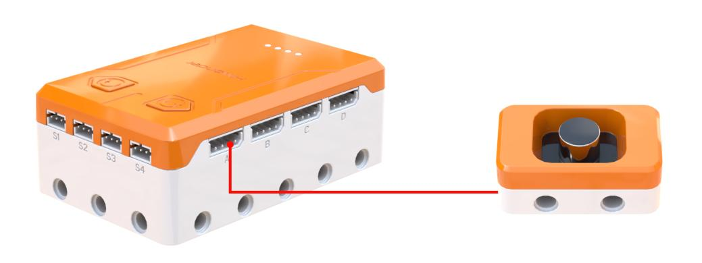

#### (4) Project Practice

Add Extension: Select **Sound sensor** under the **Input Module** category.

Case 1: Serial Sound Level Monitoring

Program Logic: Prints the sound volume value detected by the sound sensor through the AiBlock serial port.

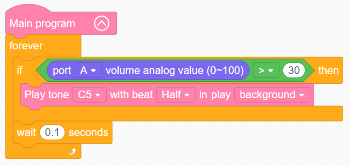

Case 2: High Sound Level Buzzer Alarm

Program Logic: Sounds a buzzer alarm when the sound sensor detects a volume greater than 30.

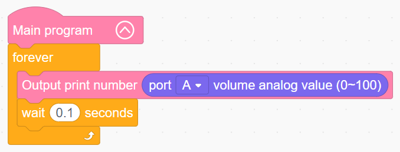

Program Upload Instructions:

Click **Connect device**, select the serial port, then click the upload button to upload the program to the controller and test the execution results.

> [!NOTE]
>
> **The source files are available for download under [Program Files](https://drive.google.com/drive/folders/1a23HgK6TJsjvy8iI9FvrCsSFKtjoYULN?usp=sharing).**

### 4.3.5 Light Sensor

#### (1) Overview

This sensor measures ambient light intensity. It is commonly employed to create interactive projects that respond to lighting changes, including automatic street lighting systems and environmental monitoring stations.

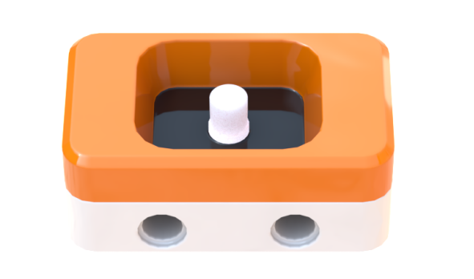

#### (2) Technical Specifications

| Item | Specification |
| :--: | :--: |
| Connector model | 5264-4AW |
| Communication method | I2C |
| Operating voltage | 5 V |
| Dimensions | 39.5 × 23.4 × 17.2 mm |

#### (3) Wiring Diagram

Connect the light sensor to any port among **A** through **D** on the controller using a 4-pin module wire, as shown below:

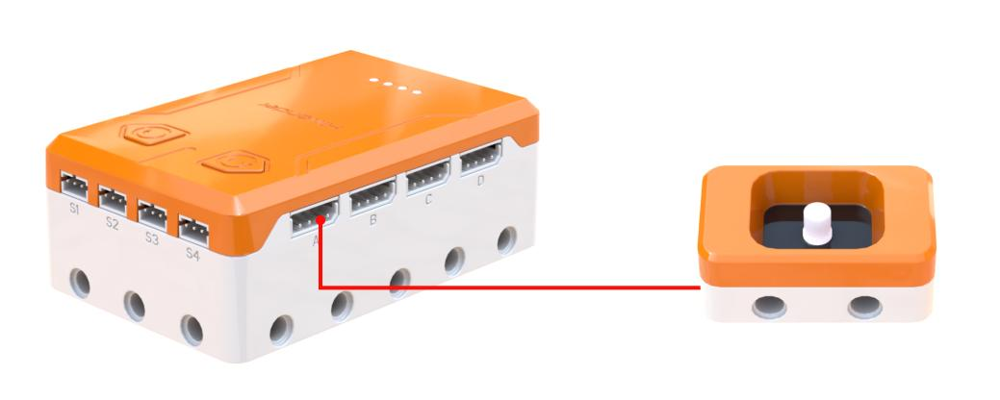

#### (4) Project Practice

Case 1: Serial Light Intensity Acquisition and Display

Add Extension: Select **Light sensor** under the **Input Module** category.

Program Logic: Displays the light intensity value measured by the light sensor through the AiBlock serial port.

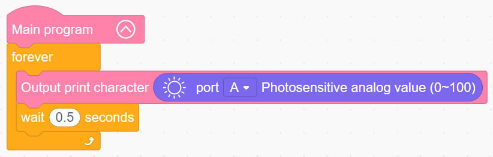

Program Upload Instructions:

Click **Connect device**, select the serial port, then click the upload button to upload the program to the controller and test the execution results.

> [!NOTE]
>
> **The source files are available for download under [Program Files](https://drive.google.com/drive/folders/1a23HgK6TJsjvy8iI9FvrCsSFKtjoYULN?usp=sharing).**

### 4.3.6 Knob Module

#### (1) Overview

This module consists of an adjustable potentiometer. Rotating the knob varies electrical resistance within a set range, adjusting output voltage accordingly. It pairs with various modules to implement diverse features such as controlling fan speed or adjusting lighting brightness.

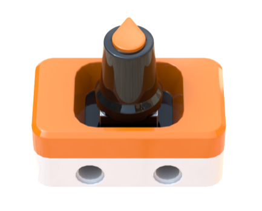

#### (2) Technical Specifications

| Item | Specification |
| :--: | :--: |
| Connector model | 5264-4AW |
| Communication method | I2C |
| Operating voltage | 5 V |
| Dimensions | 39.5 × 23.4 × 35.8 mm |

#### (3) Wiring Diagram

Connect the knob module to any port among **A** through **D** on the controller using a 4-pin module wire, as shown below:

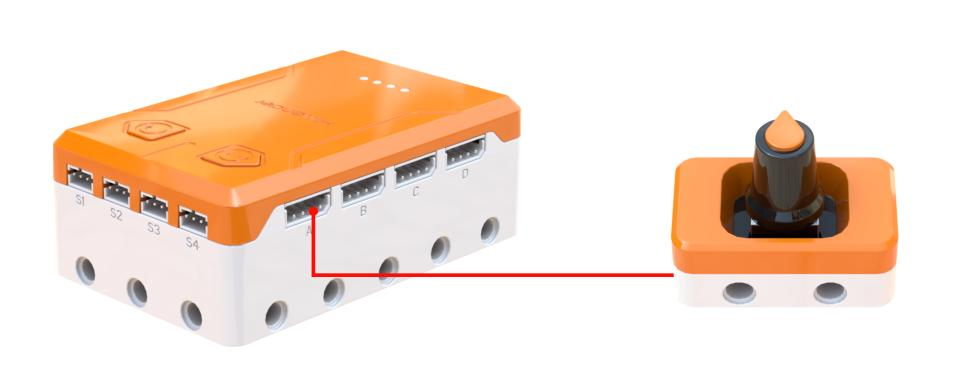

#### (4) Project Practice

Case 1: Serial Knob Potentiometer Value Reading

Add Extension: Select **Knob** under the **Input Module** category.

Program Logic: Displays the analog reading of the knob sensor through the AiBlock serial port.

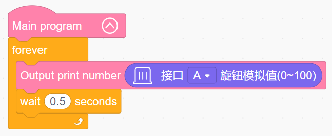

Program Upload Instructions:

Click **Connect device**, select the serial port, then click the upload button to upload the program to the controller and test the execution results.

> [!NOTE]
>
> **The source files are available for download under [Program Files](https://drive.google.com/drive/folders/1a23HgK6TJsjvy8iI9FvrCsSFKtjoYULN?usp=sharing).**

